# EchoGuard Architecture Diagram with AWS Icons

```mermaid
flowchart TD
    %% User Interface Layer
    User([User])
    
    %% Frontend
    subgraph Frontend["Frontend (React.js with AWS Amplify)"]
        WebApp["Web Application<br>React.js + AWS Amplify<br>🖥️"]
    end
    
    %% Authentication Layer
    subgraph Auth["Authentication"]
        Cognito["Amazon Cognito<br>👤"]
        IdentityPool["Identity Pool<br>🔑"]
        IAMRoles["IAM Roles<br>🛡️"]
    end
    
    %% API Layer
    subgraph API["API Layer"]
        APIGateway["Amazon API Gateway<br>🌐"]
    end
    
    %% Compute Layer
    subgraph Compute["Compute Layer"]
        APILambda["API Lambda<br>(Node.js)<br>λ"]
        StartTranscribeLambda["StartTranscribe Lambda<br>(Python)<br>λ"]
        AnalyzeTranscriptLambda["AnalyzeTranscript Lambda<br>(Python)<br>λ"]
    end
    
    %% Storage Layer
    subgraph Storage["Storage Layer"]
        AudioBucket["S3 Audio Bucket<br>📁"]
        TranscriptBucket["S3 Transcript Bucket<br>📄"]
        DynamoDB["DynamoDB<br>Audit Log Table<br>🗄️"]
    end
    
    %% AI/ML Services
    subgraph AIML["AI/ML Services"]
        Transcribe["Amazon Transcribe<br>🎤"]
        Bedrock["Amazon Bedrock<br>🧠"]
    end
    
    %% Notification Layer
    subgraph Notification["Notification Layer"]
        SNS["Amazon SNS<br>Compliance Alert Topic<br>📢"]
    end
    
    %% Monitoring Layer
    subgraph Monitoring["Monitoring & Logging"]
        CloudWatchLogs["CloudWatch Logs<br>📝"]
        CloudWatchMetrics["CloudWatch Metrics<br>📊"]
        CloudWatchAlarms["CloudWatch Alarms<br>⚠️"]
    end
    
    %% Flow connections
    User -->|"Accesses"| WebApp
    WebApp -->|"Authenticates"| Cognito
    Cognito -->|"Provides Tokens"| IdentityPool
    IdentityPool -->|"Assumes"| IAMRoles
    WebApp -->|"HTTPS/REST"| APIGateway
    APIGateway -->|"Invokes"| APILambda
    APILambda -->|"CRUD Operations"| DynamoDB
    WebApp -->|"Uploads Audio"| AudioBucket
    AudioBucket -->|"Triggers"| StartTranscribeLambda
    StartTranscribeLambda -->|"Starts Job"| Transcribe
    Transcribe -->|"Saves Results"| TranscriptBucket
    TranscriptBucket -->|"Triggers"| AnalyzeTranscriptLambda
    AnalyzeTranscriptLambda -->|"Analyzes with"| Bedrock
    AnalyzeTranscriptLambda -->|"Stores Results"| DynamoDB
    AnalyzeTranscriptLambda -->|"Sends Alerts"| SNS
    SNS -->|"Notifies"| User
    
    %% Monitoring connections
    APILambda -.->|"Logs"| CloudWatchLogs
    StartTranscribeLambda -.->|"Logs"| CloudWatchLogs
    AnalyzeTranscriptLambda -.->|"Logs"| CloudWatchLogs
    APIGateway -.->|"Metrics"| CloudWatchMetrics
    CloudWatchMetrics -.->|"Triggers"| CloudWatchAlarms
    
    %% Styling
    classDef aws fill:#FF9900,stroke:#232F3E,color:#232F3E
    classDef lambda fill:#FF9900,stroke:#232F3E,color:#232F3E
    classDef storage fill:#3F8624,stroke:#232F3E,color:#232F3E
    classDef aiml fill:#1A476F,stroke:#232F3E,color:white
    classDef monitoring fill:#7AA116,stroke:#232F3E,color:#232F3E
    
    class Cognito,IdentityPool,APIGateway,SNS aws
    class APILambda,StartTranscribeLambda,AnalyzeTranscriptLambda lambda
    class AudioBucket,TranscriptBucket,DynamoDB storage
    class Transcribe,Bedrock aiml
    class CloudWatchLogs,CloudWatchMetrics,CloudWatchAlarms monitoring
```

## AWS Architecture Diagram (PNG Version)

## Architecture Components

### User Interface Layer
- **React.js Frontend**: Web application built with React.js and AWS Amplify
  - Audio Upload Interface
  - Authentication UI
  - Compliance Dashboard
  - Audit Log Viewer

### Authentication Layer
- **Amazon Cognito**: User management, authentication, and authorization
- **Identity Pool**: Provides temporary AWS credentials
- **IAM Roles**: Define permissions for authenticated users

### API Layer
- **Amazon API Gateway**: REST API endpoints for frontend communication
  - GET /audit-logs
  - GET /compliance-stats
  - POST /upload-url
  - GET /audio-files
  - POST /manual-analysis
  - DELETE /audio-files/{id}

### Compute Layer
- **API Lambda Function (Node.js)**: Handles API requests, CRUD operations
- **StartTranscribe Lambda (Python)**: Triggered by audio uploads, starts transcription jobs
- **AnalyzeTranscript Lambda (Python)**: Processes transcripts, performs compliance analysis

### Storage Layer
- **S3 Audio Bucket**: Stores uploaded audio recordings
- **S3 Transcript Bucket**: Stores transcription results
- **DynamoDB Audit Log Table**: Stores compliance analysis results and audit trails

### AI/ML Services
- **Amazon Transcribe**: Speech-to-text service for audio transcription
- **Amazon Bedrock**: AI service for compliance analysis and natural language processing

### Notification Layer
- **Amazon SNS**: Sends real-time alerts for compliance violations

### Monitoring & Logging
- **CloudWatch Logs**: Captures logs from Lambda functions and API Gateway
- **CloudWatch Metrics**: Tracks performance metrics
- **CloudWatch Alarms**: Monitors for errors and performance issues

## Data Flow

1. User uploads audio file through React frontend
2. Frontend authenticates with Cognito and gets temporary AWS credentials
3. Audio file uploaded directly to S3 Audio Bucket
4. S3 upload event triggers StartTranscribe Lambda function
5. StartTranscribe initiates Amazon Transcribe job
6. Transcribe saves results to S3 Transcript Bucket
7. Transcript upload triggers AnalyzeTranscript Lambda function
8. AnalyzeTranscript uses Amazon Bedrock for compliance analysis
9. Analysis results stored in DynamoDB Audit Log Table
10. SNS notifications sent for compliance violations
11. Frontend queries API Gateway for audit logs and statistics
12. API Lambda function retrieves data from DynamoDB
13. Real-time updates displayed in compliance dashboard

## Security Features

- End-to-end encryption for audio files and transcripts
- IAM roles with least privilege access
- Cognito-based authentication and authorization
- API Gateway with CORS and throttling
- VPC endpoints for private communication (optional)
- CloudTrail for audit logging
- S3 bucket policies and access controls