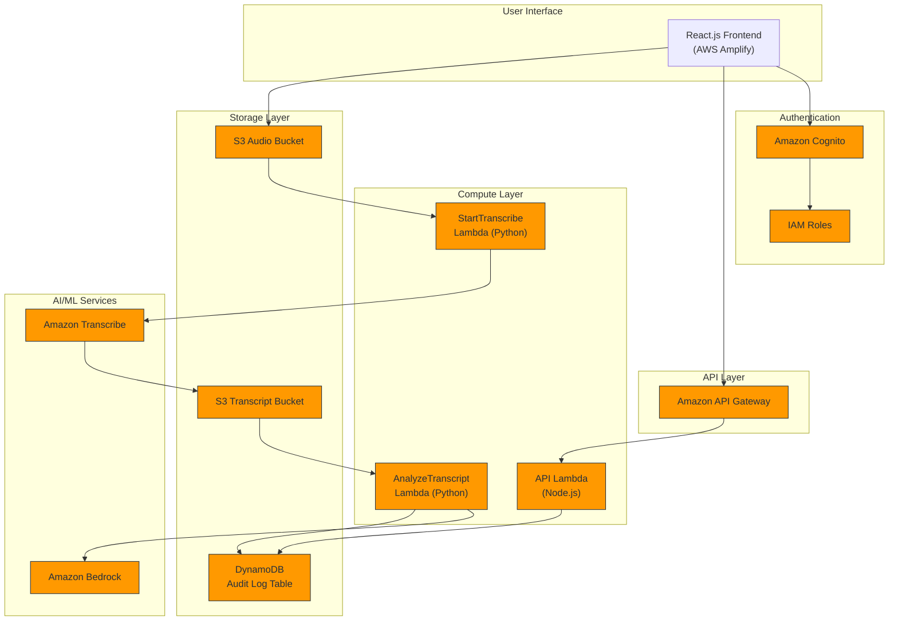

# EchoGuard Architecture Diagram

To view this diagram:
1. Copy the Mermaid code above
2. Paste it into a Mermaid live editor (https://mermaid.live/)
3. Export as PNG
4. Save the PNG to the docs/images folder as "architecture.png"